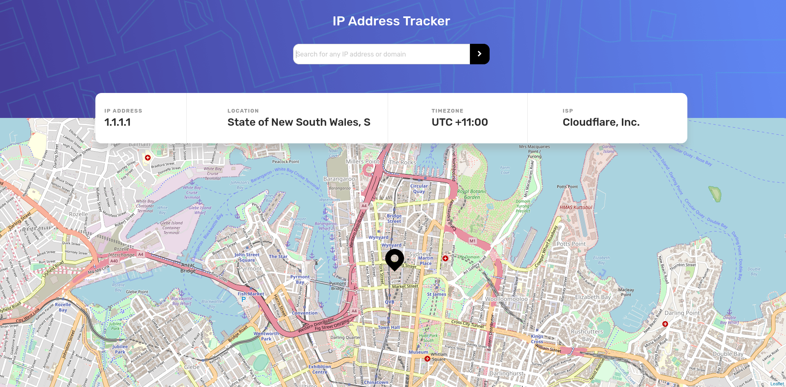
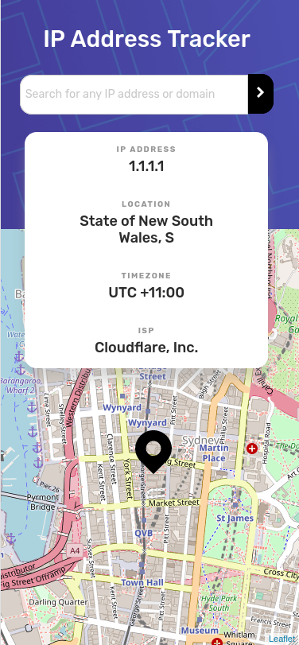

# Ip Address Tracker

This is my solution for the [Frontend Mentor challenge](https://www.frontendmentor.io/challenges/ip-address-tracker-I8-0yYAH0) made with [Svelte](https://svelte.dev/).

The challenge was to build an IP Address Tracker app and get it looking as close to the design as possible. To get the IP Address locations, I used IP Geolocation API by IPify and to generate the map, I used LeafletJS.

You can find the demo [here](https://vibrant-raman-3e60e2.netlify.app/) and two screenshots down below (desktop and mobile):

